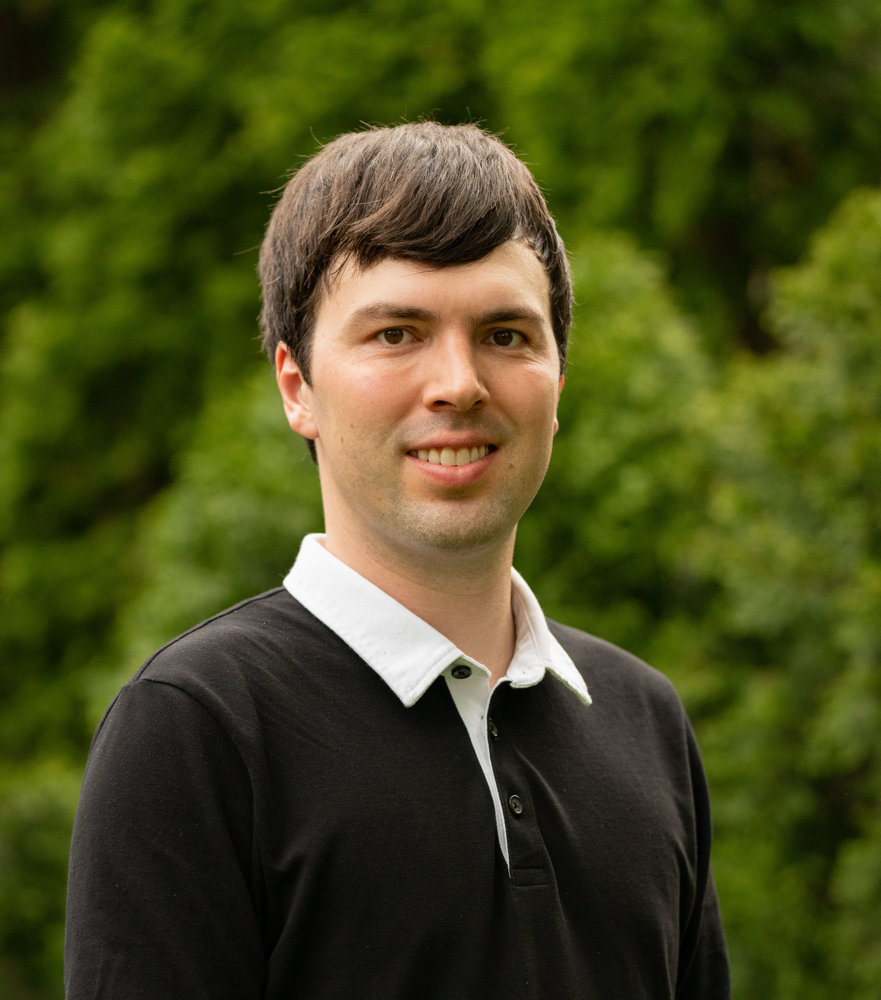

# About me

{align="right": style="float:right;height:250px"}

I joined the group at first as an M.Sc. student in 2022 and now as a Ph.D. student and Vanier Scholar since 2024. I have lived in Montréal my whole life, and French is my first language. After a brief career as a hospital pharmacist, I completed a B.Sc. in physics and computer science at Université de Montréal in 2022, where I did research in mathematical physics. Today, my broad research interests are cosmology, dark matter, and astroparticle physics. Lately I have been thinking a lot about finite temperature field theory and its applications in cosmology and astrophysics.
