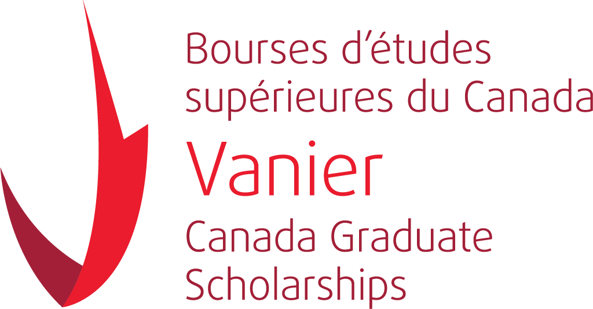

{align="right": style="float:right;height:300px"}

# Hi, I'm Hugo!

I'm a PhD student in physics and Vanier Scholar at McGill University in Montreal, Canada. I'm supervised by Prof. Katelin Schutz.

Learn more [about me](about/index.md).

Learn more about [my research](research/index.md).

Learn about some [outreach](outreach/index.md) I do.

## External links

[Research group website](https://katelinschutz.com/group)

[INSPIRE](https://inspirehep.net/authors/2050860)

[arXiv](https://arxiv.org/a/scherer_h_1.html)

## Contact me {: .no_toc}

Send me an e-mail at [hugo.scherer@mail.mcgill.ca](mailto:hugo.scherer@mail.mcgill.ca)

## Affiliations

[{align="center": style="height:80px"}](https://vanier.gc.ca/en/home-accueil.html) &nbsp; &nbsp; &nbsp; &nbsp; &nbsp;
[{align="center": style="height:80px"}](https://tsi.mcgill.ca/)  &nbsp; &nbsp; &nbsp; &nbsp; &nbsp;
[{align="center": style="height:50px"}](https://www.physics.mcgill.ca/)
