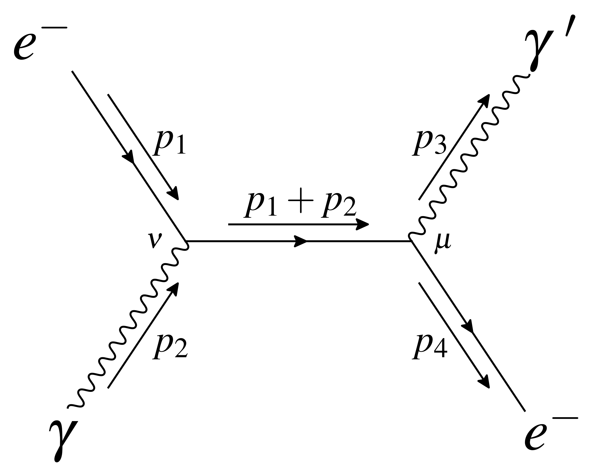
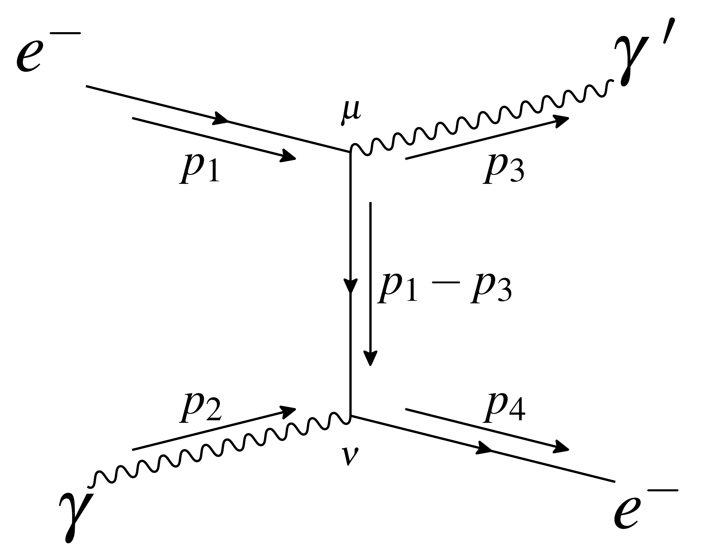
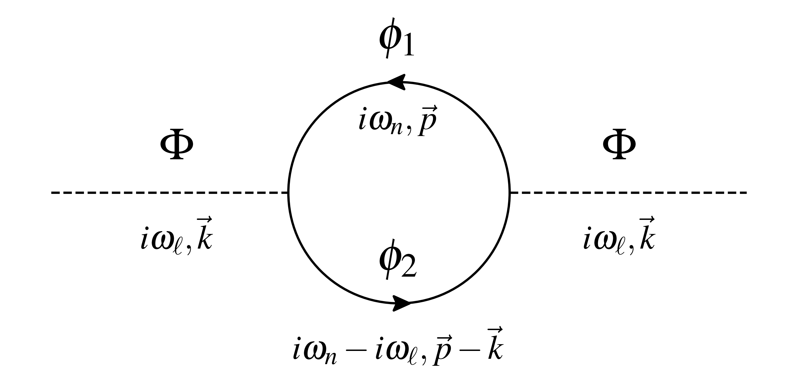
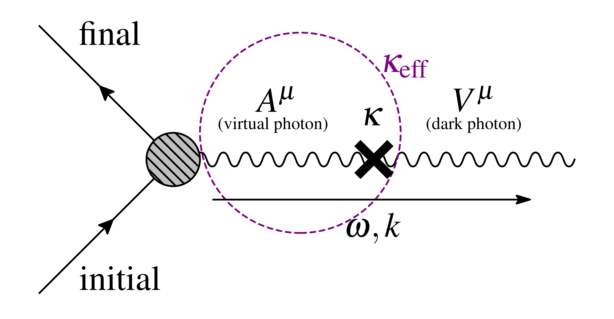

# Other Projects

## feyndraw

I made a code to draw Feynman diagrams using `matplotlib` in `python`. The package name is `feyndraw` and you can `pip install` it! Find this project on [GitHub](https://github.com/schhug/feyndraw) and [PyPI](https://pypi.org/project/feyndraw/). Here are some example drawings!

{align="left": style="float:left;width:300px"}

{align="left": style="float:left;width:300px"}

{align="left": style="float:left;width:600px"}

{align="left": style="float:left;width:600px"}

