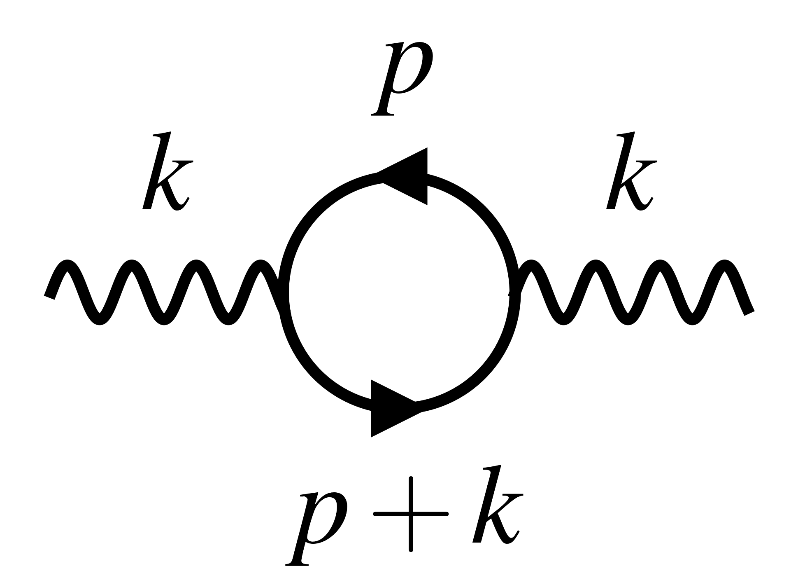

# Research

## Research interests

**Dark Matter** - I'm interested in searching of the nature of dark matter! My work is theoretical in nature, and focuses on looking for signatures or setting bounds on dark matter models, or more broadly, on physics beyond the Standard Model. These days, I'm especially curious the dark photon as an extension to the Standard Model of particle physics.

**Cosmology and astrophysics** - I'm interested in cosmology and astrophysics, especially as probes on the nature of dark matter. These days I'm particularily focusing on what happens with dark matter around the time of Big Bang Nucleosynthesis, in the early universe.

**Finite temperature field theory** - I'm interested in finite-temperature effects on particle behavior, and how they can be used as unique probes of dark matter or physics beyond the Standard Model. The early universe is a great environment for such effects!

## Latest project
{align="right": style="float:right;width:250px"}

In hot and dense environments, like plasmas, the behavior of particles are modified, sometimes in new, qualitatively different ways[@raffelt_stars_1996]. For example, the photon in a plasma acquires a new longitudinal polarization mode, as well as an effective mass. These are encoded in what we call the **photon self-energy**. Previous work had focused on the self-energy of real (or on-shell) photons, i.e. the ones that propagate through arbitrary distances[@braaten_neutrino_1993]. But the self-energy is also important for virtual (or off-shell) photons, i.e. the ones that are intermediate states in particle physics processes (like scatterings). In this project, I computed the photon self-energy for **off-shell photons**. This includes analytical approximations for the self energy as a function of temperature and electron density!

Find the paper on the arXiv [here](https://arxiv.org/abs/2405.18466)!

## Publication list

Here is a list of all my publications in physics. You can also my published work on [INSPIRE](https://inspirehep.net/authors/2050860) or [arXiv](https://arxiv.org/a/scherer_h_1.html).

You'll find that I've worked previously on exactly solvable mathematical physicics models and orthogonal polynomials!

### 2024

Photon self-energy at all temperatures and densities in all of phase space (submitted to JHEP) \[[arXiv:2405.18466](https://arxiv.org/abs/2405.18466)\]

### 2022

[A classical model for perfect transfer and fractional revival based on q-Racah polynomials](https://doi.org/10.1016/j.physleta.2022.127973) \[[arXiv:2110.01042](https://arxiv.org/abs/2110.01042)\]

[Analytic “Newton’s cradles” with perfect transfer and fractional revival](https://doi.org/10.1016/j.aop.2022.168790) \[[arXiv:2108.09386](https://arxiv.org/abs/2108.09386)\]

## Master's thesis

I completed my M.Sc. in 2024 at McGill University (Montreal, Canada), supervised by Prof. Katelin Schutz and Prof. Oscar Hernández. It is about finite temperature field theory, and more specifically about the photon self-energy (same as my latest project but with more details!). If you're interested, you can find it here:

[Finite temperature field theory for the masses (2024)](Scherer_Hugo_Physics_thesis_v3.pdf)

